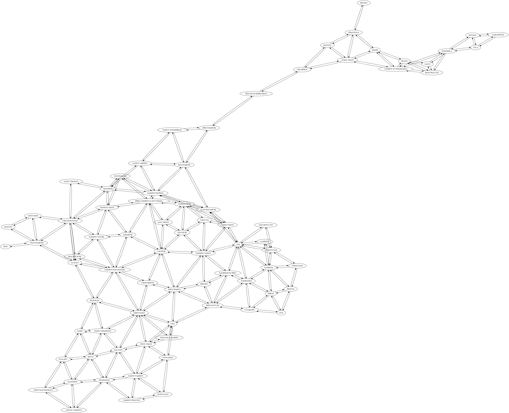

# Thailand Province Border-Adjacency Mappings

**Project:** This project creates a mapping dataset between adjacent provinces in Thailand. Dataset uses a data-relations `X -> Y, Z` convention, so we can easily integrate neighbouring provincial-level-data or visualise the relations as below using GraphViz. Python code is included to parse/verify and integrate the mappings into your own software applications.



### **Contents:** 

1. **A dataset of the province neighbours** of each province in Thailand (correct as of Feb 2nd 2021/2564). (`thailand_data_relations.txt`)

2. **Python module code to parse** the mapping dataset easily in your own applications. (`/src/`)

3. **Python module code to verify data relations for mutual consistency and naming consistency**. This can be used directly on other `data relations` (mappings) datasets that use the 'PROV_NAME' column identifier for naming conventions or with small extensions. (`/src/`)


### **What is it useful for?** 

In many geographical/GIS data analysis tasks correlating or combining datasets from different places is important to find patterns. In cases like risk analysis for COVID-19 disease infections or trends in agricultural practices, risk of wild-fires spreading, etc, a trend tends to transition across adjacent borders. 

From the ground-up, this mapping dataset lets data analysts immediately combine provincial-datasets to produce solutions to these kinds of questions.

### **Who is this intended for?** 

Mainly for Data Analysts working on regional GIS problems. Secondly, the code provides a base for Data Analysts to build and verify new "mappings" datasets.


### **Why make this project?**

A mapping dataset for Thailand's provinces is not publicly available elsewhere. Once created, it needs validating as consistent/correct.

## About the Mapping Dataset:

There are two formattings of the dataset: `thailand_data_relations.txt` and `thailand_data_relations_quoted.txt`. The latter provides each province name in double-quotes for convenience in some applications (like GraphViz).

In brief, the dataset is simply a set of relations, i.e. 

    x -> y, z

Which is read as *"`x` is related to `y` and `z`*" and one relation is given per line.

For Thailand, we have examples such as:

    Phuket -> Phangnga
    Narathiwat -> Yala, Pattani


<p align="center">
<a href="https://upload.wikimedia.org/wikipedia/commons/thumb/c/c5/Thailand_provinces_en.svg/1050px-Thailand_provinces_en.svg.png">

</a>
</p>

The `data relations` format let's us verify the ***mutual consistency*** of relations, so we can discover and correct inconsistencies by confirming that for `x -> y` there must also be a `y -> x`.

Province Neighbours are determined using the [Provinces and Administrative Areas Map Image - Wikipedia](https://en.wikipedia.org/wiki/Provinces_of_Thailand) map image (above). The canonical source for resolving ambiguities is the Province's Wikipedia entry. As an example, [Phuket Province - Wikipedia](https://en.wikipedia.org/wiki/Phuket_Province) specifies that *"Phuket Island is connected [...] to Phang Nga Province"*, unambiguously determining `Phuket -> Phang Nga`.


By following a naming convention, we can confirm ***naming consistency*** too, ensuring all names exist in a source dataset (i.e. `x` exists in our naming convention dataset). For Thailand mappings, the naming convention dataset used is the spatial provincial dataset for Thailand from [province_data_latlon.csv (utf-8)](https://github.com/pnphannisa/thailand_spatial_resources), which uses naming conventions canonically specified by Thai authorities and includes GIS coordinates per province to additionally integrate data spatially. The same naming set can be found in [Province of Thailand - Wikipedia](https://en.wikipedia.org/wiki/Provinces_of_Thailand).


## Code Requirements:
Platform requirements:
```
Python 3.x
```
Library Dependencies:
```
pandas==0.23.0
unittest (built-in for Py3)
```

## How to Use Code Module
The code can parse a mapping dataset into a mapped dictionary format, to then use programmatically in your own applications. We can import it as a module, and simply instantiate it.

The resulting dictionary format is `{ <Province Obj> : [ <Province Obj>, <Province Obj>, ... ] }`. 

By default, a `Province` has an identifier as `p.PROV_NAME` and other data `p.data`, created via `Province(PROV_Name='name', optional_dictionary_of_data)`

Before we get started, **[download the naming convention dataset by Phannisa Nirattiwongsakorn and Charin Polpanumas](https://raw.githubusercontent.com/pnphannisa/thailand_spatial_resources/master/data/province_data_latlon.csv)** and be ready to store it into your local repo directory (i.e. `thailand_province_border_adjacency/`).

For example:

```python
# Import the module:
from province_neighbours import read_provincial_dataset, read_relations_dataset, Province, ProvinceRelationParser

# - Read in the datasets:
naming_convention_dataset = read_provincial_dataset( filename="../province_data_latlon.csv" )
mappings = read_relations_dataset('../thailand_province_relations.txt')

# - Parse the mappings into a dict format:
prp = ProvinceRelationParser(mappings, naming_convention_dataset)

# Print out any consistency errors and the full set of mappings.
print( prp )
prp._report_relation_errors()  # or `prp._relation_error` in list format 
prp._report_province_naming_errors() # or `prp._province_naming_errors`
```
At this point, we have parsed and verified the mappings. Next, use the dictionary in your application:
```python
# Get the dictionary of mappings:
dictionary_of_mappings = prp.get_mappings_dict()
for k,v in dictionary_of_mappings.items():
    pass # as you like.

# Lookup Data for a Province by Name:
province = naming_convention_dataset['NARATHIWAT']
print(province)

# Lookup Neighbouring Provinces from the Dictionary:
print( dictionary_of_mappings[Province('NARATHIWAT')] )

neighbours = dictionary_of_mappings[Province('NARATHIWAT')]
print( len(neighbours) )
list_of_neighbour_names = [ p.PROV_NAME for p in neighbours ]
```

### How to Run Our Code:
```bash
git clone https://github.com/pmdscully/thailand_province_border_adjacency.git
python --version    # Verify Python version is => Py 3.x
pip install pandas==0.23.0
cd thailand_province_border_adjacency/test
python test_province_relation_parser.py
```
Once all tests pass, then:
```bash
cd ../src
python province_neighbours.py
```

## More Q &amp; A

**Is it correct &amp; up to date?** Yes. The newest Thai province change was adding Bueng Kan, which was split-off from Nong Khai, effective on 23 March 2011 - that's included; so it's up-to-date as of Feb 2021. Bangkok is referred to as a Special Administrative Area, but it's included as province in the mappings; giving a total of 77 entries.

**Is it easy to use the mapping dataset by importing a Python module into my own software application?** Yes, you can join province datasets together based on their semantic geo-neighbourhoods  :-). 

1. Just <code>git clone</code> the repository, 
2. <code>download a province naming dataset</code> , 
3. <code>import the python module</code>, 
4. Write about <strong>4 lines of code</strong> to give you a dictionary lookup.


**I want to SQL join my provincial datasets together, but only for the provinces nextdoor, how can I do that?** Yes, that's precisely what this dataset and code is for. Before you create your SQL query:

1. import the Python module (**`province_neighbours.py`**), 
2. instantiate the ProvinceRelationsParser object
3. get the dictionary
4. perform the dictionary lookup on your key province, this will give you the list of neighbouring provinces. 
5. Simply plug those names into your SQL query and you are ready!


## Final words

All original contents in the repo are licensed under the MIT License, i.e. free use and modify without warranty.

For any questions or issues, feel free to get in contact. I'm always happy to know how our open source work gets used, so let me know if you find it useful.